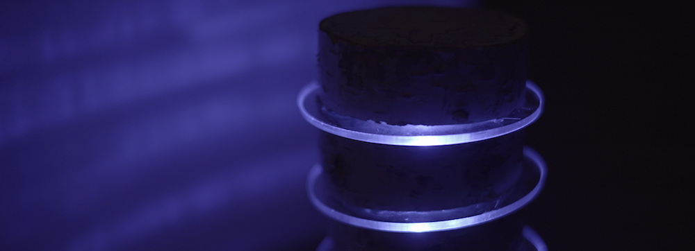

# Climate Tree

The idea behind the project «Climate Tree» is to increase awareness for the climate change. Trees and other plants are directly affected by the climate change, but they do not show us the urgency of the problem. The «Climate Change» installation tries to approach this problem and give the plants a new communication system in form of a lamp. As an example, a birch tree trunk has been cut into several pieces and has been reconstructed with acrylic glass in between each piece. On the inside of the trunk, there is an LED strip together with an IoT device and a temperature sensor. Now the tree is able to show the current temperature and if it has cold or hot. For us humans, it is like a very simple and understandable signal.
